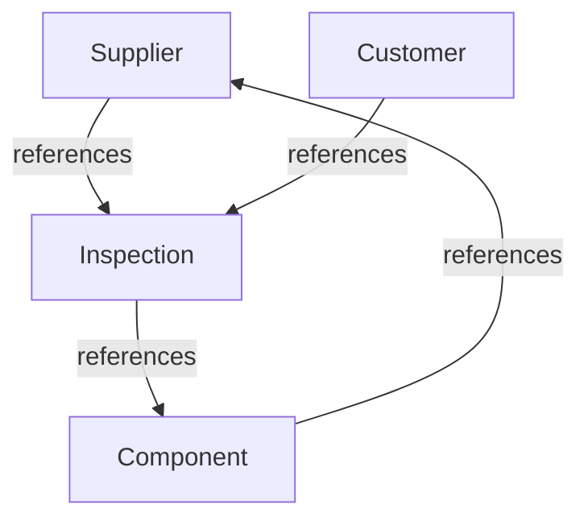

# AeroSuite Architecture Overview

AeroSuite uses Domain-Driven Design (DDD) with clear bounded contexts:

## Layers
- Presentation (React, API controllers)
- Application (Services, Orchestrators)
- Domain (Models, Aggregates, Repositories)
- Infrastructure (DB, Caching, Messaging)

## Deployment
- Dockerized microservices
- K8s for orchestration
- CI/CD via GitHub Actions

See ADRs in this folder for key decisions. 