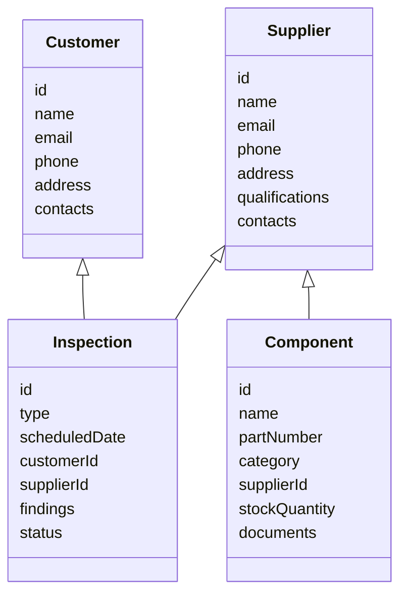

# Domain Models

## Supplier
- id, name, email, phone, address, qualifications, contacts

## Customer
- id, name, email, phone, address, contacts

## Inspection
- id, type, scheduledDate, customerId, supplierId, findings, status

## Component
- id, name, partNumber, category, supplierId, stockQuantity, documents

See code for full field definitions and validation. 
